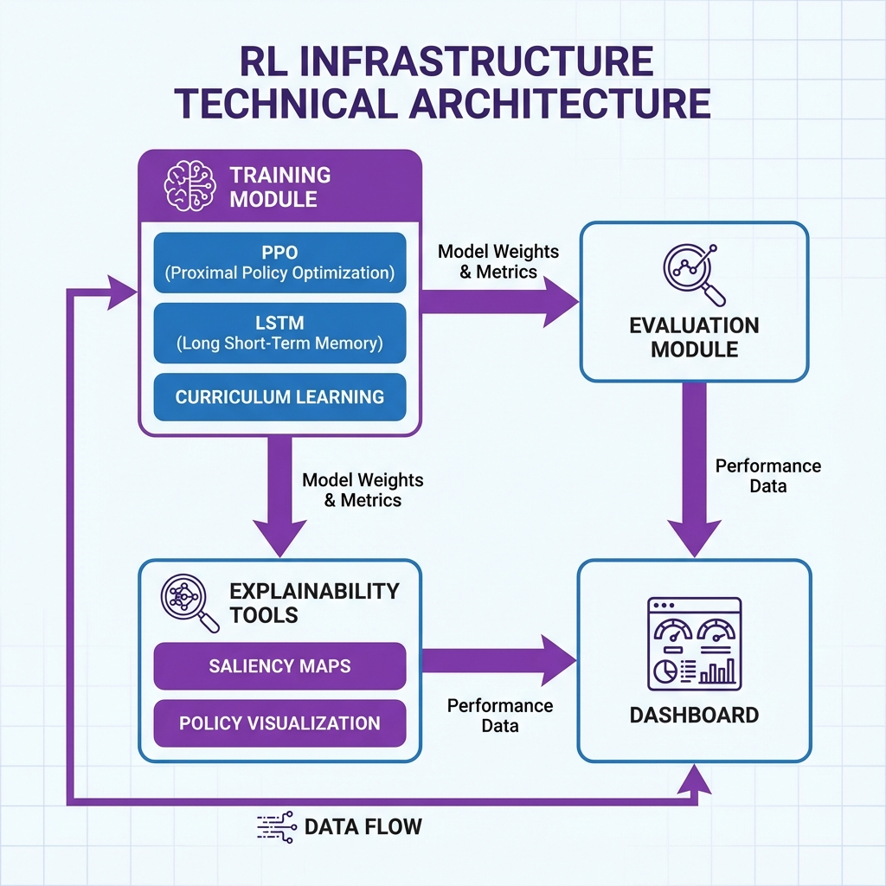
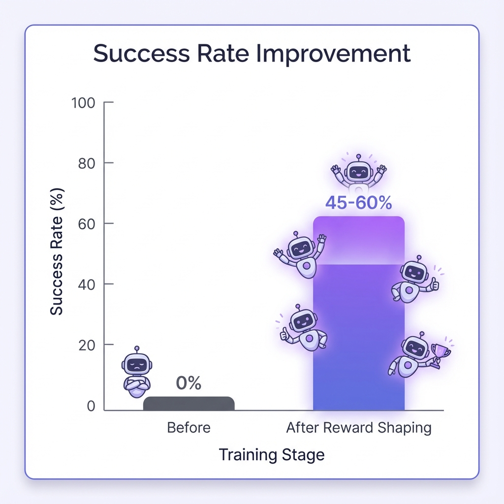

#  Portfolio Images

## Generated Images (4 total)

All images saved in ssets/ folder:

### 1. Project Banner (project_banner.png)
- **Use**: GitHub repository header
- **Size**: 1200x300px
- **Theme**: Purple gradient with neural network viz
- **Content**: Title + subtitle with tech icons

### 2. Dashboard Preview (dashboard_preview.png)
- **Use**: Show dashboard UI in README
- **Size**: 800x450px
- **Theme**: Dashboard with progress bars & charts
- **Content**: Week progress, metrics, glassmorphism design

### 3. Architecture Diagram (rchitecture_diagram.png)
- **Use**: Technical documentation
- **Size**: 1000x600px
- **Theme**: Clean component diagram
- **Content**: Modules, data flow, connections

### 4. Results Comparison (
esults_comparison.png)
- **Use**: Show training improvements
- **Size**: 800x500px
- **Theme**: Before/after bar chart
- **Content**: 0% vs 45-60% success rate

---

## Usage in README

Images already embedded in README.md:
- Banner at top
- Dashboard in Features section

Add more images:
```markdown
## Architecture



## Results


```

---

## Commit & Push

```bash
git add assets/ README.md
git commit -m "Add professional portfolio images"
git push
```

Images will display on GitHub! 
